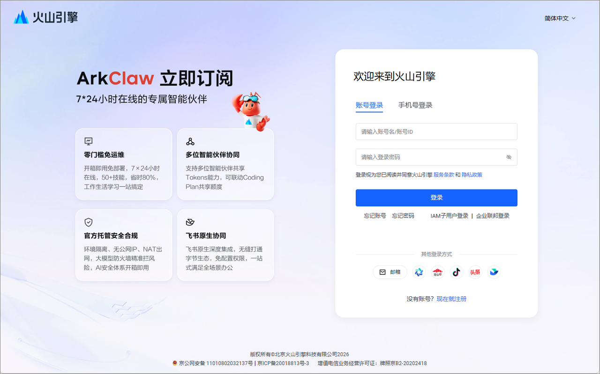
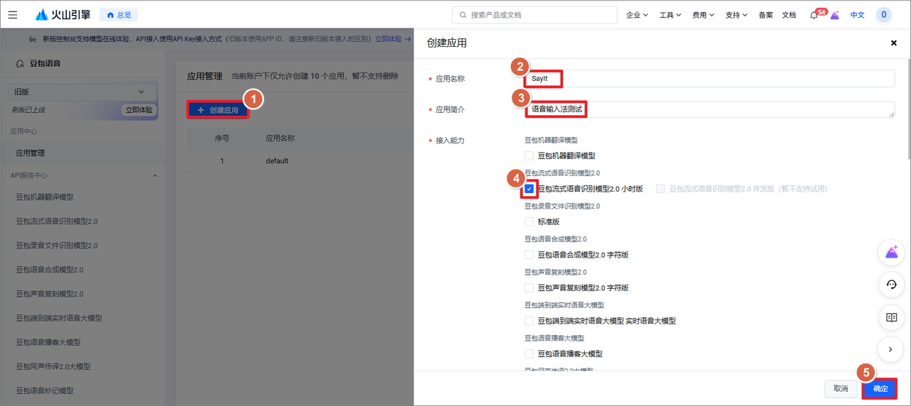
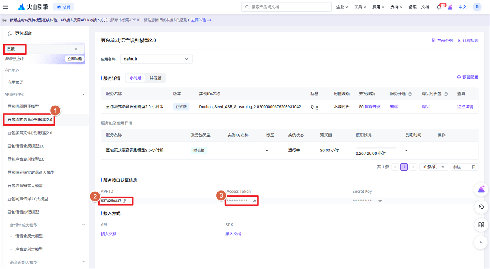
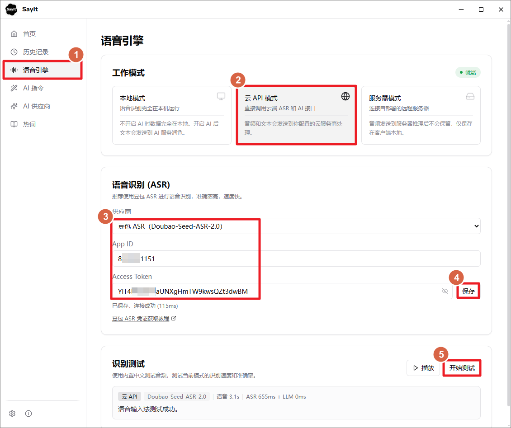

# SayIt 语音识别配置

SayIt 支持三种语音识别模式：

- **云端** **API**：调用云服务商的语音识别接口，准确率最高，适合大多数个人用户
- **本地推理**：使用本地模型离线识别，不需要网络，但准确率和速度不如云端
- **服务器模式**：自己部署后端服务，适合团队或有定制需求的场景

对个人用户来说，**云端** **API** **是最推荐的方式**，下面主要介绍这个模式。

## 1. 最佳实践

中文语音识别准确率最高的是**豆包流式语音识别 2.0**（Seed-ASR-2.0），其次是阿里的**千问 Audio ASR**（qwen-audio-3.1-asr-flash-streaming）。

SayIt 对豆包和千问 ASR 都做了流式优化——按住说话时，音频会实时发送给服务端，松手后只需要等待最后一小段音频的处理时间，通常几百毫秒就能拿到结果。

另外 SayIt 还支持**千问 Omni** 多模态模型，这类模型原生支持音频输入、文本输出，可以在转录的同时执行 Prompt 指令（比如去口癖、翻译等），相当于 ASR + AI 润色一步到位。

| 供应商       | 模型                                 | 特点                     | 价格                    |
| ------------ | ------------------------------------ | ------------------------ | ----------------------- |
| **豆包**     | Seed-ASR-2.0                         | 中文准确率最高，推荐首选 | 1.00 元/小时            |
| **阿里千问** | qwen-audio-3.1-asr-flash-streaming   | 流式识别，速度极快       | 见官方价格页            |
| **阿里千问** | qwen3.8-omni-flash                   | ASR + AI 一步到位        | 按 Token 计费（见下方） |

### 热词支持情况

「热词」在不同识别模式里的作用不完全一样：

下表是完整对照。**应用里不需要查这张表** —— 热词页会直接告诉你当前这套配置会不会发送热词，这里是做选型时用的。

| 识别服务 | 热词是否进入 ASR 识别 | 说明 |
| --- | --- | --- |
| 豆包 Seed-ASR-2.0 | 发送 | 通过火山引擎 `context` 字段直传给 ASR。 |
| 千问 Audio 3.1 / 3.0 流式 | 发送 | 走 `parameters.vocabulary`（词条带权重），两代都接受这个字段。SayIt 每次最多发送 100 条，这是 SayIt 的发送上限，不是千问的限制。 |
| 千问 qwen3-asr-flash / realtime | 发送 | 作为上下文偏置传给千问；流式版使用 `corpus.text`。 |
| 千问 Omni 系列 | 发送 | 拼进给模型的指令，作用弱于上面几种。 |
| 服务器模式 | 发送 | 服务端会把热词作为识别上下文，适合团队统一维护术语表。 |
| OpenAI gpt-live-transcribe | 开着实时字幕时发送 | 走 Realtime 转写会话的 `keywords`，SayIt 最多发送 100 条。**关掉实时字幕会改走文件转写，那条路不发送热词。** |
| OpenAI 其他转写模型 | 不发送 | 走 `/audio/transcriptions`。这条接口唯一能放词表的 `prompt` 字段被 SayIt 用于中文标点引导了（没有它，中文短句一个标点都不会有）。 |
| Gemini gemini-3.5-transcribe | 发送 | 拼进转写指令。 |
| Gemini Live | 不发送 | Live API 没有公开的热词字段。**关掉实时字幕会改走文件转写，那条路会发送。** |
| Groq Whisper | 不发送 | 同 `/audio/transcriptions` 那一栏的原因。 |
| OpenRouter | 不发送 | 它的两种请求形态都没有热词通道（multipart 那条接受 `prompt` 但忽略）。 |
| 小米 MiMo | 不发送 | 协议有位置（OpenAI 对话式接口），SayIt 尚未接入。 |
| OpenAI 兼容服务（自建 / 网关） | 取决于协议 | 探测为对话式接口（`/chat/completions`）时发送；探测为文件转写（`/audio/transcriptions`，自建 whisper.cpp、faster-whisper、FunASR 都是这套）时不发送。点「测试连接」会显示探到的是哪一种。 |
| 本地模型（Qwen3-ASR / SenseVoice / Fun-ASR Nano） | 不发送 | 本地引擎迁到 GGML 之后没有热词通道。 |

不发送热词的那些服务，热词仍有两处用处：

1. **识别完成后的写法还原** —— 云端识别会自动把 `Say It` 拼回 `SayIt`，不需要任何设置。
2. **AI 整理阶段纠正** —— 需要同时开启「AI 整理」和「热词注入提示词」（后者默认关闭）。录音过短被跳过、或 AI 调用失败时这一步不会执行，所以它是补救手段，不是自动兜底。

因此，如果你要让「Typeless」「SayIt」这类产品名在 ASR 阶段就尽量识别正确，优先选豆包、千问或服务器模式。

## 2. 使用豆包语音识别

SayIt 支持使用字节跳动「豆包流式语音识别模型 2.0」作为语音识别引擎。豆包 ASR 是目前中文语音识别准确率最高的模型，推荐使用。

1. 注册 / 登录火山引

打开[火山引擎语音服务控制台](https://console.volcengine.com/speech/service/10038)，用手机号注册或登录即可。已有账号的直接登录，没有账号会引导你先注册。

1. 完成实名认证

火山引擎的 API 服务需要先做实名认证，没认证的话后面创建应用会卡住。进入[实名认证页面](https://console.volcengine.com/user/authentication/detail/)，按页面提示走完就行。

1. 创建应用并获取 APP ID

进入[应用管理页面](https://console.volcengine.com/speech/app1)，点击「创建应用」。填写应用名称和简介（随便写就行），关键一步：一定要勾选「豆包流式语音识别模型 2.0 小时版」，不然后面用不了。

1. 获取APP ID 和 Access Token

进入 [API 服务中心页面](https://console.volcengine.com/speech/service/10038)，点击「豆包流式语音识别模型2.0」（配图是旧版界面）。页面上会显示你的 APP ID，鼠标放到 Access Token 上面，点击小眼睛图标，可以看到 Access Token 信息。

记录下来这两个信息填到 SayIt 软件中。选择 语音引擎 - 云 API 模式 - 选择ASR供应商为豆包 ASR，填写凭证信息后可以保存测试。

豆包开通试用后，半年内有 20 小时的[免费额度](https://www.volcengine.com/docs/6561/1359369?lang=zh)。超出免费额度后，按量计费：豆包流式语音识别模型 2.0 — 1 元/小时。[后付费价格详情](https://www.volcengine.com/docs/6561/1359370?lang=zh)

> **热词支持**：豆包 ASR 已接入 SayIt 的热词功能。在「个性化」里配置的热词会在每次识别时直传给豆包（通过火山引擎的 `context` 热词直传字段），无需在火山控制台单独配置词表，专业术语、人名等识别更准。

## 3. 阿里千问 ASR

一个 API Key 就能用百炼上的全部八个模型，在「模型」下拉里切换。分三族：

**Qwen-Audio-ASR-Flash-Streaming（推荐，默认就是它）**

边说边出字的流式识别，开着实时字幕时这一族最准。两代都在列表里：

- **qwen-audio-3.1-asr-flash-streaming**：最新一代，默认选项
- **qwen-audio-3.0-asr-flash-streaming**：上一代，能力相同，留作 3.1 出问题时的退路

这两个都**不需要**业务空间 ID，填完 API Key 就能用。

**qwen3-asr-flash / qwen3-asr-flash-realtime**

上一代的纯语音识别模型，多语种表现均衡：

- **qwen3-asr-flash**：非流式，录完再发，速度也很快
- **qwen3-asr-flash-realtime**：流式，但效果不及 Audio 3.x，而且需要填业务空间 ID

**Omni 系列（识别 + 整理一步完成）**

多模态模型，直接接收音频输出文本。和「ASR + AI 润色」两步走不同，Omni 一步完成，可以在 System Prompt 里直接控制输出格式（去口癖、翻译、列表排版等）。适合不想分别配置 ASR 和 AI 润色的人。

- **qwen3.8-omni-flash**：最新一代，走 HTTP 接口，可以填自己的地址（中转站、或百炼的业务空间专属域名）
- **qwen3.8-omni-flash-realtime**：和上面那个同一代、结果相同，走官方实时接口，地址不能改。两者计费口径不同，长期使用前先看官网价格
- **qwen3.5-omni-plus** / **qwen3.5-omni-flash**：plus 质量更好，flash 更快更便宜

Omni 都不支持实时字幕（整段说完再出结果）。

> 上一代的 `qwen3-omni-flash` 与 `qwen-omni-turbo` 已从列表中移除——阿里已公告下线，实测它们的实时接口也已开始限流。原先选了这两个的配置会自动切到 `qwen3.5-omni-flash`，不需要重新填密钥。

**配置方式**

在 SayIt 设置中选择千问 ASR 系列，需要填写 API Key。

- 获取 API Key：[阿里百炼平台](https://bailian.console.aliyun.com/cn-beijing?tab=model#/api-key)

> **热词支持**：千问 ASR 系列也已接入 SayIt 的热词功能。在「个性化」里配置的热词会作为上下文偏置随每次识别一起传给千问（流式版用 `corpus.text`，非流式与 Omni 用 system 上下文），有效提升专业术语、人名等识别准确率。

## 4. 接入自建或第三方服务（OpenAI 兼容）

内置清单之外的服务走「OpenAI 兼容服务」这张卡：自建的 whisper.cpp、faster-whisper、FunASR，以及各类聚合网关和中转站。

**配置方式**

- **接口地址**：填到 `/v1` 为止即可，例如 `http://127.0.0.1:8000/v1`；填完整路径（`…/v1/audio/transcriptions`）也认。前提是服务确实在该地址上运行。
- **接口协议**：默认「自动识别」，由 SayIt 用第一次真实转写试出来。文件转写与对话式转写是不同协议；后者又有两种不兼容的音频载荷。自动识别判不准时可以手动指定：
  - `transcriptions` → `POST /v1/audio/transcriptions`，multipart 上传文件。自建的 whisper.cpp、faster-whisper、FunASR 都是这一套。
  - `chat` → `POST /v1/chat/completions`，音频作为 data URL 字符串放进 `input_audio`。阿里云百炼走这一套；已有设置继续使用此格式。
  - `chat_standard` → `POST /v1/chat/completions`，音频作为 `input_audio: { "data": "<base64>", "format": "wav" }`。标准 OpenAI-compatible 音频接口及 Gemini 网关通常要求这一套。
  - 这两条都不是 FunASR 自己的 WebSocket 实时服务，那套协议不同，SayIt 不通过这张卡接入。
- **模型名**：按目标服务 `GET /v1/models` 返回的值填。注意 `whisper-1` 在不少实现里只是映射到启动时所选模型的兼容别名，填了它并不代表加载的是 Whisper。

**热词**

走 `transcriptions` 这条协议时**不发送热词**。这条接口唯一能放词表的 `prompt` 字段被 SayIt 用于中文标点引导了（没有它，中文短句一个标点都不会有）。走 `chat` 或 `chat_standard` 时会把热词拼进指令一起发送。

点「测试连接」会显示探测到的是哪一种协议，并一并说明热词是否发送。

附带一点：FunASR 的两种 OpenAI 兼容 HTTP 服务（仓库示例 `server.py` 与打包的 `funasr-server`）都没有声明 `prompt` 表单字段，所以 SayIt 发出的那段标点引导在它们那里会被忽略——接 FunASR 时中文短句是否带标点，取决于所选模型自身（例如 `paraformer` 系配置了标点组件）。

**验收建议**

基础转写能通和热词生效是两件事，分开验：连通性测试只能证明协议对得上、请求能到达服务，证明不了热词参与了识别。

## 5. 价格

下面是各个模型按需使用的价格参考。

| 模型                                    | 价格            | 免费额度               |
| --------------------------------------- | --------------- | ---------------------- |
| 豆包 Seed-ASR-2.0                       | 1.00 元/小时    | 20 小时（半年内）      |
| 千问 qwen-audio-3.x-asr-flash-streaming | 按音频时长计费  | 有，以控制台为准       |
| 千问 qwen3-asr-flash（非流式）          | 0.79 元/小时    | 10 小时（90天内）      |
| 千问 qwen3-asr-flash-realtime（流式）   | 1.19 元/小时    | 10 小时（90天内）      |
| 千问 Omni 系列                          | 按 Token 计费   | 100 万 Token（90天内） |

阿里调价和推新模型比这份文档更新得勤，Audio 3.x 与 Omni 各代的单价请直接看[千问价格文档](https://help.aliyun.com/zh/model-studio/model-pricing#95f0464a10q5c)——这里只写会不会按时长还是按 Token 收费，那个口径比数字稳定。Omni 按 Token 计费时每秒音频约 25 token，可用来粗估。
